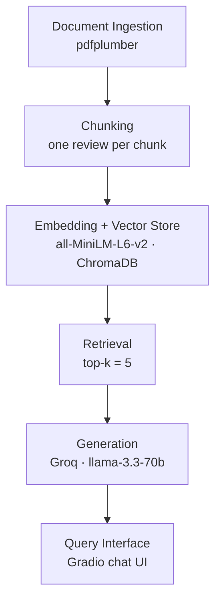

# Project 1 Planning: The Unofficial Guide

> Write this document before you write any pipeline code.
> Your spec and architecture diagram are what you'll use to direct AI tools (Claude, Copilot, etc.) to generate your implementation — the more specific they are, the more useful the generated code will be.
> Update the Retrieval Approach and Chunking Strategy sections if you change your approach during implementation.
> Update this file before starting any stretch features.

---

## Domain

**Rate My Professor and course planning at Stony Brook University (CS department)**

I'm building a guide for picking CS professors and planning courses ahead of time. SOLAR tells you who's teaching this semester, but it won't tell you who students actually recommend, if someone is an easy grader or actually helps you learn, or which courses they usually teach. That info lives on Rate My Professors, and you have to click through each professor, scroll tons of reviews, and figure out which comments match courses like CSE 114 or CSE 316 on your own.

A high rating doesn't say much by itself. Students care about grading, lecture quality, workload, group projects, office hours, and whether they'd take the class again. Having all that in one place lets you plan semesters ahead instead of scrambling at registration and ending up in a bad section.

---

## Documents

| # | Source | Description | URL or location |
|---|--------|-------------|-----------------|
| 1 | Scott Stoller | Full Rate My Professor review history (CSE308, CSE535, distributed systems/project courses) | `raw/Scott Stoller at Stony Brook University (SUNY) _ Rate My Professors.pdf` |
| 2 | Christopher Kane | Full Rate My Professor review history (CSE215, CSE307, CSE316, software design and theory) | `raw/Christopher Kane at Stony Brook University (SUNY) _ Rate My Professors.pdf` |
| 3 | Ali Raza | Full Rate My Professor review history (ISE218, CSE312, intro and systems courses) | `raw/Ali Raza at Stony Brook University (SUNY) _ Rate My Professors.pdf` |
| 4 | Amir Rahmati | Full Rate My Professor review history (CSE524, security and grad-level CS courses) | `raw/Amir Rahmati at Stony Brook University (SUNY) _ Rate My Professors.pdf` |
| 5 | Dimitris Samaras | Full Rate My Professor review history (CSE327 computer vision, grad-level courses) | `raw/Dimitris Samaras at Stony Brook University (SUNY) _ Rate My Professors.pdf` |
| 6 | Eugene Stark | Full Rate My Professor review history (CSE306, CSE320, systems and architecture courses) | `raw/Eugene Stark at Stony Brook University (SUNY) _ Rate My Professors.pdf` |
| 7 | Himanshu Gupta | Full Rate My Professor review history (networking and upper-level CS courses) | `raw/Himanshu Gupta at Stony Brook University (SUNY) _ Rate My Professors.pdf` |
| 8 | I.V. Ramakrishnan | Full Rate My Professor review history (CSE596, grad courses; mixed grading and teaching reviews) | `raw/I.V. Ramakrishnan at Stony Brook University (SUNY) _ Rate My Professors.pdf` |
| 9 | Michael Ferdman | Full Rate My Professor review history (CSE356, CSE502, computer architecture and systems) | `raw/Michael Ferdman at Stony Brook University (SUNY) _ Rate My Professors.pdf` |
| 10 | Paul Fodor | Full Rate My Professor review history (CSE114, CSE214, CSE316; largest review count in corpus) | `raw/Paul Fodor at Stony Brook University (SUNY) _ Rate My Professors.pdf` |

**Coverage:** Intro programming (Fodor), software design/theory (Kane), systems/architecture (Stark, Ferdman), distributed systems (Stoller), security/grad courses (Rahmati), computer vision (Samaras), networking (Gupta), and a mix of strongly positive and strongly negative grad-level reviews (Ramakrishnan). All sources are manually saved Rate My Professor PDFs because the site blocks automated scraping.

---

## Chunking Strategy

**Method:** Review-boundary semantic chunking

**Chunk size:** One review block (variable length, usually 100–800 characters depending on the comment)

**Overlap:** 0. Each review is already a complete unit with course, scores, tags, and comment. No need to duplicate text across chunks.

**Reasoning:**

Fixed-size chunking cuts every 500 characters regardless of content, which can split a long review in half or mix two reviews in one chunk. Semantic chunking splits at review boundaries instead, so each chunk is one student's full opinion about one course. That makes retrieval more accurate because the LLM always gets complete context (course name + tags + comment together). Paul Fodor will still produce the most chunks since his page has the most reviews.

---

## Retrieval Approach

**Embedding model:** `all-MiniLM-L6-v2` via sentence-transformers

**Top-k:** 5 chunks per query

**Production tradeoff reflection:**

Semantic chunking (splitting at review boundaries) is more accurate than fixed-size splitting because each chunk is one complete opinion. It takes slightly more work to parse PDFs into structured review blocks first, but the reviews already have clear structure on Rate My Professor. Semantic search at query time (embeddings + cosine similarity) is separate from semantic chunking: chunking decides how you split before storing, search decides how you find chunks when a user asks. Both together give better results than fixed-size chunking plus keyword search.

**Why top-k = 5:** Each chunk is one full review, so k is really "how many student reviews do we show the LLM?"

- **k = 1–2 is too risky.** One review might be an outlier or about a different course. If the top match is wrong, the whole answer is wrong.
- **k = 5 gives room for corroboration.** Questions like "Does Fodor record lectures?" need more than one review to show a pattern. Five is enough to catch 2–3 students saying the same thing without reading every review on the page.
- **k = 10+ adds noise.** Semantic search ranks by relevance; matches get weaker after the top few. At k = 10 you start pulling in reviews about other courses or professors (especially for broad queries), which dilutes the prompt and can confuse the LLM.
- **Five fits the chunk size.** Each review is ~100–800 characters. Five reviews is a small, focused context block for the LLM. Ten or more reviews would eat more tokens without much benefit for short opinion text.

There is no magic formula for 5. It is a practical default for short, self-contained chunks: enough recall to see consensus, not so much that unrelated reviews flood the prompt. If retrieval tests show k = 3 missing relevant reviews or k = 7 adding junk, I would tune it.

**Why semantic search works here:** Embeddings capture meaning, not just exact words. A query like "easy intro programming professor" can match reviews tagged "AMAZING LECTURES" with difficulty 2.0 for CSE 114 even when the review never says "easy" or "intro." That's why semantic search fits this corpus better than keyword matching alone.

**Post-Milestone fixes (still semantic, k = 5):** Full-chunk embeddings diluted short facts like "records his lectures," so `build_embedding_text()` now embeds compact text (tags, record sentences, or first 300 chars of body). Professor/course names in a query trigger metadata filters in Chroma. These fixes are separate from the hybrid stretch feature below.

---

## Stretch Feature: Hybrid Search (Extra Credit)

**Goal:** Combine semantic search (MiniLM + Chroma cosine) with keyword search (BM25) and compare top-k results to semantic-only on the same 5 evaluation questions.

**Why this stretch:** Pure semantic search missed exact phrases ("records his lectures", RMP tag strings) until we changed embedding text. BM25 should catch exact token matches; semantic search should catch paraphrases. Hybrid merges both with Reciprocal Rank Fusion (RRF) without increasing k.

**Plan:**

| Piece | Approach |
|-------|----------|
| Keyword index | `rank_bm25` over the same compact text used for embeddings (`build_embedding_text`) |
| Merge | RRF with k = 60 over top-20 candidates from each retriever |
| Filter | Same professor/course `where` filters as semantic-only |
| Compare | Run `python retriever.py --compare` on all 5 eval queries; record which mode ranks the expected review higher |
| UI | Gradio dropdown: Semantic only vs Hybrid |

**Success criteria:** Hybrid ranks the expected review at #1 (or ties) on queries with exact keywords (Fodor recording, Kane tags). Semantic-only may still win on broad sentiment questions (Ramakrishnan negativity) where meaning matters more than exact words.

---

## Evaluation Plan

| # | Question | Expected answer |
|---|----------|-----------------|
| 1 | Does Paul Fodor record his lectures for CSE 114? | Yes. Multiple reviews explicitly state he records lectures (e.g., "he records his lectures" in Dec 2025 and Nov 2024 CSE114 reviews). |
| 2 | What Rate My Professor tags do students assign to Christopher Kane for CSE 307? | TOUGH GRADER, LECTURE HEAVY, ACCESSIBLE OUTSIDE CLASS. The Mar 2026 review also gives Quality 5.0 and Difficulty 5.0. |
| 3 | What courses does Scott Stoller teach according to student reviews? | CSE308, CSE535, and CSE302. Reviews describe distributed systems content, research papers, and group/project-based coursework. |
| 4 | What do students say about I.V. Ramakrishnan's CSE 596 class? | Overwhelmingly negative: Quality 1.0, Difficulty 5.0, tagged TOUGH GRADER. Reviews describe him as disrespectful, toxic, and berating students. At least one review says "NEVER TAKE HIS COURSE." |
| 5 | How does Ali Raza prepare students for exams in ISE 218? | He gives topics or questions prior to exams and quizzes. Reviews note tough exams but clear expectations, and that he checks whether the class understands before moving on. |

---

## Anticipated Challenges

1. **Paul Fodor has way more reviews than everyone else.** Generic questions like "good CS professor" or "intro programming" might keep pulling up Fodor even when you're asking about someone else, just because he has so many reviews in the database.

2. **Course names aren't consistent.** The same class shows up as `114`, `CSE114`, or `CS114` in different reviews. Search might handle some of that, but a query like "CSE 114" could miss reviews that only say "114."

3. **Same professor, opposite opinions.** I.V. Ramakrishnan has terrible reviews for CSE 596 and good ones for CSE 537. The system might only find one side and make it sound like that's how he always is.

4. **Some professors barely have any reviews.** Someone like Dimitris Samaras only has a few. With top-k = 5, there might not be much to pull from, so answers about those professors will be thin.

---

## Architecture



```
Rate My Professor PDFs  →  Chunking  →  Embed + Store  →  Retrieve  →  Generate  →  Chat UI
pdfplumber   1 review/chunk  MiniLM            top-5       Groq LLM     Gradio
             semantic split  ChromaDB          cosine
```

**Pipeline summary:**

| Stage | Tool / library |
|-------|----------------|
| Document Ingestion | pdfplumber, custom Rate My Professor parser in `ingest.py` |
| Chunking | Review-boundary semantic chunking (one review per chunk) |
| Embedding + Vector Store | sentence-transformers (`all-MiniLM-L6-v2`), ChromaDB |
| Retrieval | ChromaDB cosine search + optional BM25 hybrid (RRF), top-k = 5 |
| Generation | Groq API, `llama-3.3-70b-versatile`, grounded system prompt |
| Interface | Gradio `ChatInterface` in `app.py` |

---

## AI Tool Plan

**Milestone 3 — Ingestion and chunking:**

- **Tool:** Cursor / Claude
- **Input:** Documents section, Chunking Strategy section, existing `ingest.py` skeleton, and README preprocessing notes
- **Expected output:** PDF preprocessing into structured `.txt` files; review-boundary `chunk_document()` that splits on review delimiters with metadata (`source`, `chunk_id`, `course`, `date`)
- **Verification:** Run ingestion, confirm 10 `.txt` files in `documents/`, spot-check that each chunk is one full review with course + scores + tags + comment. Count total chunks (~1 per review).

**Milestone 4 — Embedding and retrieval:**

- **Tool:** Cursor / Claude
- **Input:** Retrieval Approach section, Architecture diagram, config constants (`EMBEDDING_MODEL`, `N_RESULTS`, `CHROMA_PATH`), and retriever skeleton
- **Expected output:** `embed_and_store()` to embed chunks with MiniLM and persist in ChromaDB; `retrieve()` to return top-5 chunks with source metadata for a query
- **Verification:** Run retrieval on 3 test queries manually (e.g., "Fodor CSE 114 lectures", "Kane tough grader", "Ramakrishnan CSE 596"). Confirm returned chunks mention the right professor and course.

**Milestone 5 — Generation and interface:**

- **Tool:** Cursor / Claude
- **Input:** Evaluation Plan questions, Architecture diagram, `generator.py` and `app.py` skeletons, Groq API setup from `.env.example`
- **Expected output:** Grounded system prompt that restricts answers to retrieved context and refuses out-of-scope queries; Gradio chat handler wiring `retrieve()` → `generate_response()`; source attribution in responses
- **Verification:** Run all 5 evaluation questions through the app. Check that answers match expected answers, cite professor/source names, and that an out-of-scope question (e.g., "What's the best dining hall at SBU?") returns a refusal.
